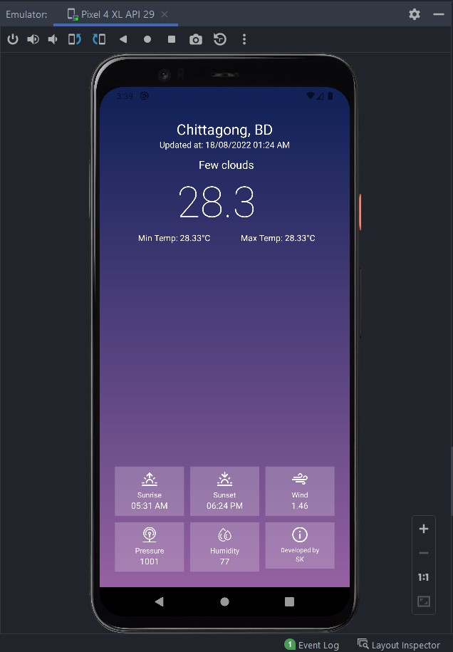

# Android-Weather-App

 

This app is an API based weather checking app. I have used OpenWeatherMap API. The app shows weather informations like like Temperature, Pressure, Humidity, Weather status, Time of Sunrise and Sunset etc

